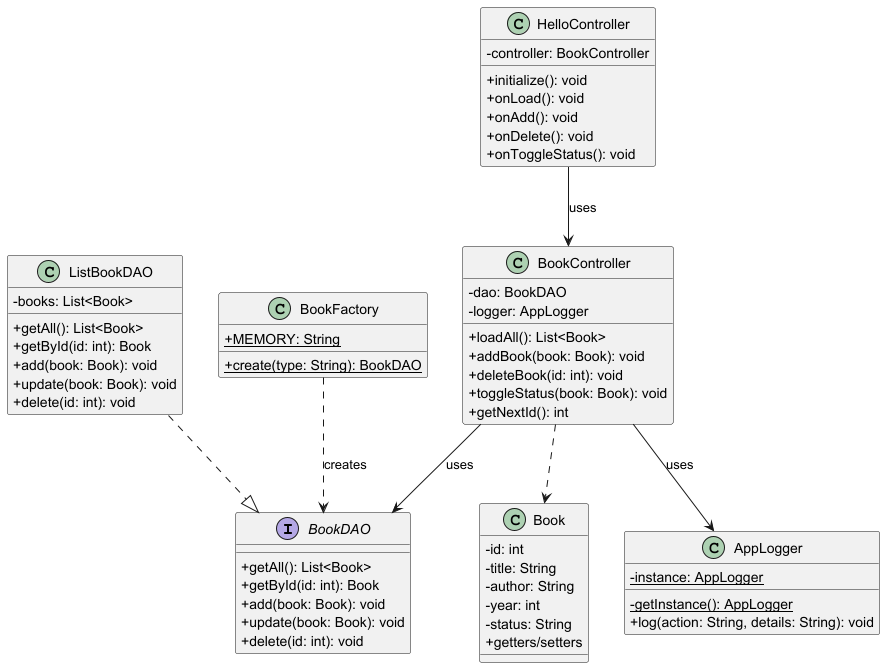
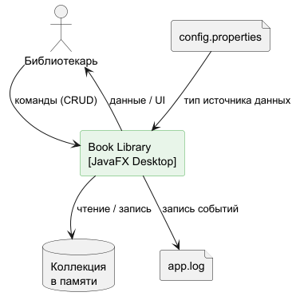
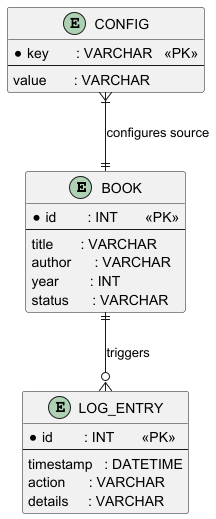

# Book Library — DAO Pattern

Лабораторная работа №3 — паттерн **DAO (Data Access Object)**.  
Десктопное JavaFX-приложение для управления библиотекой книг.

---

## Содержание

- [Описание](#описание)
- [Функционал](#функционал)
- [Архитектура](#архитектура)
- [Диаграммы](#диаграммы)
- [Запуск](#запуск)
- [Тесты](#тесты)
- [Ветки Git](#ветки-git)
- [Конфигурация](#конфигурация)

---

## Описание

Система управления каталогом книг. Реализует паттерн **DAO** для разделения бизнес-логики и доступа к данным.  
MVP-спринт: источник данных — коллекция в памяти (`ListBookDAO`).

---

## Функционал

| Действие | Описание |
|----------|----------|
| Просмотр | Список всех книг в таблице |
| Добавление | Форма с полями Название / Автор / Год |
| Удаление | Удаление выбранной строки |
| Статус | Переключение «Доступна» ↔ «Выдана» |
| Логирование | Все операции пишутся в `app.log` и в TextArea UI |

---

## Архитектура

Многослойная архитектура **MVC + DAO**:

```
src/main/java/org/example/library/
├── model/
│   └── Book.java               # Сущность — книга
├── dao/
│   ├── BookDAO.java            # Интерфейс доступа к данным
│   └── ListBookDAO.java        # Реализация: коллекция в памяти
├── factory/
│   └── BookFactory.java        # Фабрика DAO по типу источника
├── logger/
│   └── AppLogger.java          # Синглтон-логгер → app.log
├── controller/
│   └── BookController.java     # Бизнес-логика + вызовы логгера
├── HelloController.java        # FXML-контроллер (UI)
└── HelloApplication.java       # Точка входа JavaFX
```

---

## Диаграммы

### Use Case


---

### Диаграмма классов



---

### Контекстная диаграмма



---

### ER-диаграмма



---

## Запуск

### Через Maven

```bash
mvn javafx:run
```

### Через IntelliJ IDEA

Run/Debug Configurations → Main class:

```
org.example.library.HelloApplication
```

---

## Тесты

```bash
mvn test
```

| Тест-класс | Что проверяет |
|-----------|--------------|
| `ListBookDAOTest` | CRUD операции над коллекцией |
| `BookControllerTest` | Логика контроллера с Mockito-моком |

---

## Ветки Git

| Ветка | Содержание |
|-------|-----------|
| `main` | Финальная версия |
| `mvp`  | Коллекция в памяти + рабочий JavaFX UI |

### Рекомендуемые коммиты

```
feat: add Book model
feat: add BookDAO interface
feat: implement ListBookDAO
feat: add BookFactory
feat: add AppLogger singleton
feat: add BookController
feat: add JavaFX UI (HelloController + FXML)
test: add unit tests for DAO and Controller
docs: add README with diagrams
```

---

## Конфигурация

Файл `config.properties` **не включён в репозиторий** (добавлен в `.gitignore`).  
Создайте вручную в корне проекта:

```properties
# Тип источника данных
datasource.type=Память
```
